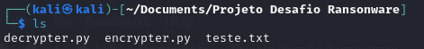
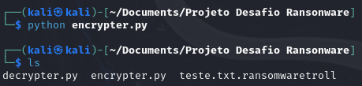
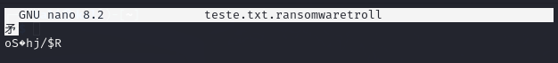
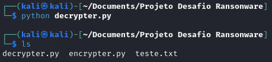
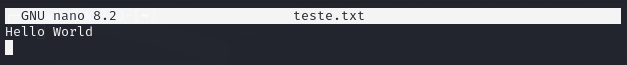

# Entendendo um Ransomware na Prática

## Ferramentas

- Kali Linux
- Python
- Pacote pyaes

## Instalando Pyaes no Kali Linux
```bash
sudo apt update
sudo apt install python3-pyaes
```
### Desafio
Exibindo o conteúdo do diretório:
- Script de descriptografia em python
- Script de criptografia em python
- Arquivo com um texto comum


Conteúdo do teste.txt


Criptografando a mensagem
Por causa do Script, o nome do arquivo foi alterado para teste.txt.ransonwaretroll


Conteúdo do teste.txt.ransonwaretroll


Descriptografando a mensagem
O nome do arquivo foi alterado para o seu título original (teste.txt)


Verificação da descriptografia
A mensagem Hello World é legível agora


