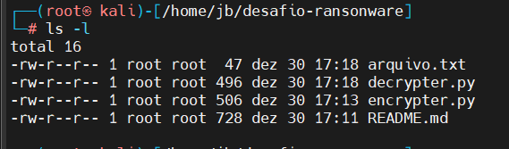
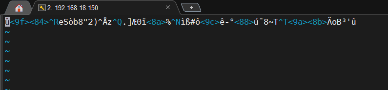
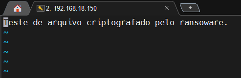

# Desafio de projeto Ransomware

>Este desafio de projeto faz parte do conteúdo abordado pelo *Santander Bootcamp Cibersegurança*,
>realizado pela [DIO](https://web.dio.me/track/santander-bootcamp-ciberseguranca?tab=about)
>em parceria com o Santander Universidades.

## Sobre o projeto
Este projeto foi criado utilizando Python e faz uso da biblioteca pyaes para realizar a encriptação.

## Arquivos do projeto
* **arquivo.txt:** Arquivo que será criptografado 
* **encrypter.py:** Código que irá criptografar o arquivo `arquivo.txt`, alterando a sua extensão para `arquivo.txt.ransomware` e deixando seu conteúdo criptografado.
* **decrypter.py:** Código que irá descriptografar o arquivo `arquivo.txt.ransomware`.

### Prints

### Lista de Arquivos

### Texto Criptografado

### Texto Descriptografado

